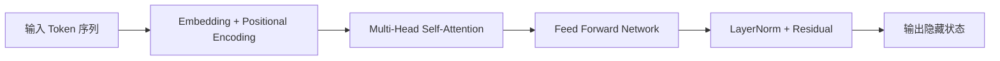
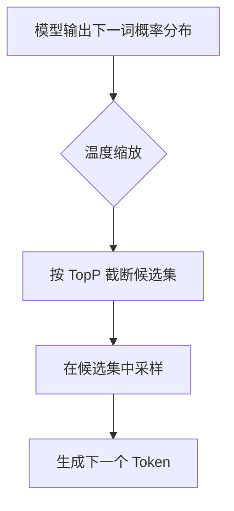

### Tokenization & Context Window

Tokenization（分词）是 LLM 处理文本的第一步：模型不会直接理解“字”或“词”，而是把输入切分为 token 序列再计算。

- 常见切分方式：`BPE`、`WordPiece`、`SentencePiece`。
- 同一句中文在不同 tokenizer 下，token 数量可能不同，直接影响推理成本与上下文占用。
- `Context Window` 指模型一次可处理的最大 token 数，输入与输出总和都受它限制。

工程上可用以下近似关系做窗口预算：

```text
总窗口 = system prompt + user prompt + 检索上下文 + 历史对话 + 预留输出
```

如果不做预算控制，常见后果是：超长截断、关键信息被挤出、回答质量波动。

### Transformer & Attention (Conceptual Understanding)

Transformer 的核心是 Self-Attention：每个 token 在生成时都会“关注”其他 token，并按相关性分配权重。



关键理解：

- `Q/K/V` 本质是“查询-匹配-聚合”。
- 多头注意力允许模型并行建模不同关系（语义、语法、长距离依赖）。
- 残差连接与归一化保证深层网络训练稳定。

### Pre-training vs Fine-tuning vs Instruction Tuning

三者是能力形成的不同阶段，不是互斥关系：

| 阶段 | 目标 | 数据特点 | 结果 |
|---|---|---|---|
| Pre-training | 学习通用语言与世界知识模式 | 大规模通用语料 | 形成基础语言能力 |
| Fine-tuning | 学习特定任务或领域行为 | 标注数据/领域数据 | 提升垂直任务性能 |
| Instruction Tuning | 对齐“按指令完成任务” | 指令-回答数据 | 可控性和遵循指令能力更强 |

企业常见路径：`基础模型 -> 指令微调 -> 业务增强（RAG/工具调用）`。

### RLHF Role in Alignment

RLHF（Reinforcement Learning from Human Feedback）用于把“会生成”进一步优化为“更符合人类偏好地生成”。

典型流程：

1. 先做 SFT（监督微调），得到基础对话行为。
2. 收集人类偏好排序数据，训练 Reward Model。
3. 用强化学习优化策略模型，使输出更倾向高奖励回答。

主要作用：

- 降低有害、偏题、不可用回答的概率。
- 提高有用性、可读性与安全性。

局限：偏好数据带有主观性，且无法覆盖全部真实场景。

### Temperature / TopP Control Mechanism

`Temperature` 和 `TopP` 是最常见的生成随机性控制参数。

- `Temperature`：控制概率分布平滑程度。
  - 低温（如 0.1~0.3）：更稳定、更保守。
  - 高温（如 0.8~1.2）：更发散、更具创造性。
- `TopP`（Nucleus Sampling）：仅在累计概率达到 `p` 的候选集合内采样。
  - `TopP` 越小，输出越集中。
  - `TopP` 越大，输出越多样。



实践建议：

- 事实问答：低温 + 中低 `TopP`。
- 创意生成：中高温 + 中高 `TopP`。
- 生产环境应固定参数并配合离线评测，防止输出漂移。

### Hallucination Mechanism Analysis

Hallucination（幻觉）是模型机制与信息边界共同导致的系统性现象，而非单纯“随机失误”。

主要成因：

1. 训练目标是 next-token prediction，保证“统计上像”，不保证“事实为真”。
2. 训练语料存在噪声、过时信息与冲突知识。
3. 上下文不足或歧义时，模型会用先验模式补全缺口。
4. 解码参数过于发散时，错误 token 更容易被采样。

可缓解但无法完全消除，常见治理手段：

- 用 `RAG` 提供可验证外部证据。
- 输出来源引用或不确定性声明。
- 在高风险场景加规则校验与人工复核。
