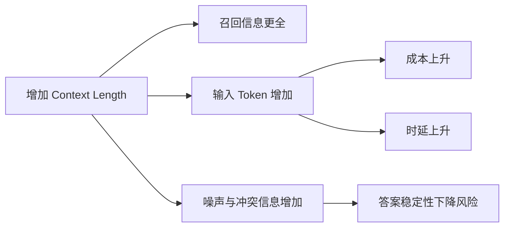

### Why LLMs do not have persistent memory

LLM 默认是“无状态推理”系统：每次调用只看当前请求中提供的上下文，不会天然记住上一次会话细节。

核心原因：

1. 推理阶段参数固定：模型不会在每次对话后自动更新权重。
2. 会话隔离设计：API 调用通常是独立请求，历史信息需要由应用层显式传入。
3. 工程与合规要求：默认不保留长期个人上下文，便于权限控制与隐私治理。

因此，“长期记忆”通常不是模型内生能力，而是应用层能力：`会话存储 + 检索召回 + 权限控制`。

### Why hallucination cannot be fully eliminated

幻觉不能被彻底消除，只能持续压低概率。

原因在于：

- 目标函数限制：LLM 优化的是“下一个 token 概率”，不是“事实真实性证明”。
- 知识不完备：训练数据有时滞、噪声和冲突，且无法覆盖实时世界。
- 上下文不充分：当证据缺失时，模型会用统计先验补全。
- 生成机制随机性：即使低温解码也无法保证 100% 事实正确。

工程目标应从“零幻觉”改为“可观测、可追踪、可兜底”的风险管理：

- 关键答案必须可溯源（RAG 引用）。
- 高风险任务加入规则引擎与人工复核。
- 建立幻觉反馈闭环（标注-评测-回归）。

### Prompt sensitivity & stability

Prompt 对输出影响极大，微小措辞变化都可能导致行为偏移，这种现象称为 Prompt Sensitivity。

常见不稳定来源：

- 指令层级冲突（system / developer / user 表述不一致）。
- 约束不明确（格式、边界条件、拒答策略缺失）。
- 上下文噪声过多（无关信息稀释关键任务）。
- 过度依赖“隐含理解”，缺少明确判定标准。

提升稳定性的实践：

1. 固化模板：固定角色、目标、输入结构、输出 schema。
2. 显式约束：写清“必须/禁止/若不确定则返回什么”。
3. 少样本示例：给出正反例，降低歧义空间。
4. 参数固定：在生产环境锁定 `temperature`、`top_p`、`max_tokens`。
5. 回归测试：对核心 prompt 做版本化和数据集回放。

### Context length vs cost tradeoff

更长的上下文并不总是更好。它同时带来成本、时延和噪声累积。

简化关系：

```text
总成本 ≈ (输入 token + 输出 token) × 单价
总时延 ≈ 预处理 + 检索 + 模型推理(与 token 规模相关)
```



建议策略：

- 不追求“塞满窗口”，而是追求“高相关、可验证、低冗余”。
- 通过 `chunk` 切分 + `TopK` + 重排控制输入规模。
- 给输出预留固定预算，避免回答被截断。
- 按场景分层：普通请求短上下文，高价值请求再启用长上下文与深检索。
