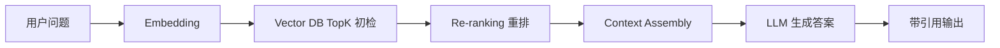

### Embedding Model vs LLM

在 RAG 架构中，Embedding Model 与 LLM 分工不同：

- Embedding Model：把文本映射为向量，用于“找相关内容”。
- LLM：基于检索到的上下文做“理解、推理与生成”。

两者关键差异：

| 维度 | Embedding Model | LLM |
|---|---|---|
| 核心目标 | 语义表示与相似度检索 | 语言生成与任务执行 |
| 输入输出 | 文本 -> 向量 | 文本 -> 文本 |
| 典型指标 | 检索召回率、向量一致性 | 准确率、可读性、遵循指令 |
| 成本结构 | 通常更低，批处理友好 | 通常更高，推理成本敏感 |

工程上应避免“只调 LLM 不调 Embedding”，因为检索质量直接决定生成上限。

### Vector Database

Vector Database（向量数据库）用于存储向量及其元数据，并支持高效近邻检索（ANN）。

核心能力：

- 向量索引（如 HNSW / IVF）与相似度搜索（Cosine / Dot Product）。
- 元数据过滤（如租户、文档类型、权限标签）。
- 批量写入与增量更新，支持在线知识演进。

常见数据结构：

```json
{
  id: "chunk_123",
  embedding: [0.021, -0.114, ...],
  text: "...",
  metadata: {
    tenant_id: "t1",
    doc_id: "d88",
    acl: ["finance_read"],
    updated_at: "2026-02-26"
  }
}
```

向量库不是“只管存向量”，它同时是检索治理与权限隔离的关键执行层。

### Chunking Strategy

Chunking（切块）决定了知识颗粒度，是 RAG 成败的第一道门槛。

常见策略：

- Fixed-size Chunking：按固定 token 长度切分，简单高效。
- Sliding Window：使用重叠窗口，减少跨段信息断裂。
- Structure-aware Chunking：按标题、段落、表格、代码块等结构切分。
- Semantic Chunking：按语义边界切分，减少“同块多主题”。

设计原则：

1. 每个 chunk 尽量只表达一个主语义单元。
2. 长文档优先“结构切分 + 轻重叠”，而非粗暴定长切分。
3. chunk 过小会丢上下文，过大会引入噪声并抬高成本。

### Retrieval TopK

TopK 是从向量库返回候选片段数量的控制参数，直接影响召回与噪声平衡。

- K 太小：高概率漏掉关键证据（under-retrieval）。
- K 太大：无关信息增多，干扰生成并抬高 token 成本（over-retrieval）。

实践建议：

- 先以离线评测确定基线 K（如 5/10/20 分层评估）。
- 对不同任务使用动态 K（FAQ 小 K，复杂分析大 K）。
- 配合重排层而不是盲目增大 K。

可以把 TopK 理解为“召回阀门”，不是越大越好，而是“刚好够用”。

### Re-ranking Layer

重排层（Re-ranking）在初检后的候选集合上再次打分，目的是把“最相关且最可信”的片段排到前面。

为什么需要重排：

- 向量相似度只反映“语义接近”，不等于“回答当前问题最有用”。
- 多文档场景下会出现主题接近但事实不匹配的候选。

常见重排信号：

- Query-Chunk 相关性分数（Cross-Encoder）。
- 元数据权重（新鲜度、文档权威级别、来源可信度）。
- 业务规则（优先内部知识库、优先已审核内容）。

重排层的价值是把“可检索”升级为“可用证据”。

### Context Assembly

Context Assembly（上下文组装）是把最终候选证据拼接成 LLM 可消费 Prompt 的过程。

核心目标：

- 保留证据完整性：不要切断关键定义、条件、数字。
- 控制 token 预算：按相关性与优先级裁剪。
- 明确引用结构：便于答案可追溯。

推荐组装模板：

```text
[System Instruction]
[Task]
[Retrieved Context #1 with source]
[Retrieved Context #2 with source]
...
[Constraints: answer with citations / if unsure say unknown]
```



高质量 RAG 的关键不是“检索更多”，而是“组装更准、更短、更可验证的上下文”。
