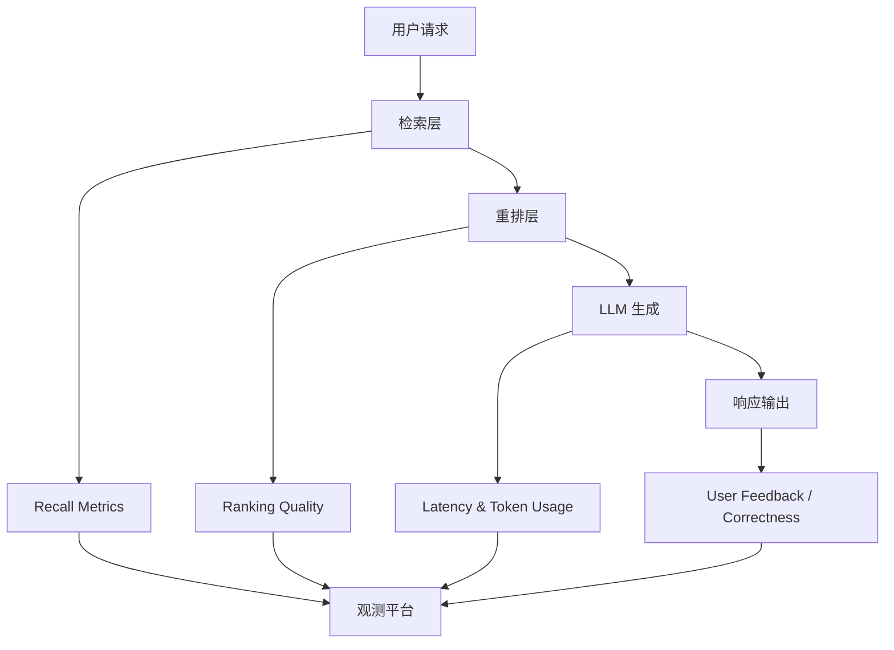

### Access Control Isolation

企业 RAG 必须先解决“谁可以看到什么”，再谈召回效果。

核心原则：

- 检索前授权（pre-filter）：先按用户身份和权限过滤可检索文档范围。
- 检索后校验（post-check）：对最终候选再次做 ACL 校验，防止越权片段混入上下文。
- 最小权限：默认拒绝，按角色/策略精确放行。

常见隔离维度：

- 用户级（user_id）
- 角色级（RBAC）
- 标签级（ABAC，如部门、项目、数据密级）
- 文档级与段落级（chunk-level ACL）

如果只在应用层做权限，而向量库无隔离过滤，容易出现“语义命中但权限越界”的高风险泄露。

### Multi-tenant Retrieval Design

多租户场景下，检索架构要同时满足隔离、安全与成本效率。

常见方案：

1. 物理隔离：每租户独立索引/独立库。
2. 逻辑隔离：共享集群 + tenant_id 强过滤。
3. 混合隔离：高敏租户物理隔离，普通租户逻辑隔离。

设计取舍：

- 物理隔离：安全边界最清晰，但运维与成本更高。
- 逻辑隔离：资源利用率更高，但治理和审计要求更严格。

建议在元数据中统一保留：`tenant_id`、`data_classification`、`policy_version`，便于审计与回溯。

### Incremental Knowledge Update

企业知识库是动态变化的，RAG 需要增量更新而非全量重建。

推荐流程：

1. 变更捕获：监听文档新增/修改/删除事件。
2. 增量切块：仅重算受影响 chunk。
3. 向量更新：upsert 新向量，删除失效向量。
4. 索引刷新：确保检索层在可控延迟内可见新数据。

关键机制：

- 文档版本号与时间戳（支持回滚与灰度）。
- 幂等写入（重复事件不导致脏数据）。
- 删除一致性（源文档删除后，向量索引必须同步失效）。

目标不是“实时到毫秒”，而是“可解释的更新时延 SLA”。

### Latency Optimization

RAG 延迟通常由“检索链路 + LLM 推理”共同决定。

优化抓手：

- 检索侧：向量索引参数调优、缓存热点 query、并行检索（多路召回）。
- 重排侧：限制候选规模，必要时使用轻量重排模型。
- 生成侧：缩短上下文、限制输出长度、按场景选择模型规格。
- 系统侧：异步预处理、连接复用、超时与降级策略。

可操作原则：

- 先拆分延迟：`embedding`、`vector search`、`rerank`、`generation` 分段监控。
- 优先优化 P95/P99，而不是只看平均值。

### Cost Control Strategy

企业成本控制要覆盖“索引成本 + 在线检索成本 + 生成成本”全链路。

主要杠杆：

- Token 成本控制：减少无关上下文、限制最大输出、启用摘要压缩。
- 模型分级路由：普通请求走小模型，复杂请求升级大模型。
- 检索分层：先低成本召回，再对少量候选做高成本重排。
- 缓存策略：query 结果缓存、答案缓存、embedding 缓存。

成本治理建议：

1. 建立单请求成本公式与预算阈值。
2. 为不同业务线设定成本配额和告警。
3. 定期做“效果-成本”双目标评测，避免只降本导致质量崩塌。

### Observability Metrics (recall, latency, token usage)

没有可观测性，就无法持续优化 RAG。

最小指标集：

- Recall 相关：`retrieval_recall@k`、`hit_rate`、`citation_coverage`
- 延迟相关：`p50/p95/p99`（分阶段）
- Token 相关：`input_tokens`、`output_tokens`、`context_tokens`
- 成本相关：`cost_per_request`、`cost_per_success`
- 质量相关：人工标注正确率、幻觉率、拒答率

建议把指标与发布流程绑定：每次策略变更都要有回归对比和阈值守护，避免“线上变快但答案变差”。
