### Over-retrieval Noise

Over-retrieval 指召回片段过多或相关性不足，导致上下文被噪声污染。

典型现象：

- 回答变“啰嗦但不准”，关键信息被淹没。
- 不同来源的冲突信息同时进入上下文，模型输出摇摆。
- token 成本上升明显，但正确率不升反降。

常见根因：

- `TopK` 设定过大且缺少重排。
- chunk 粒度过粗，一个片段包含多个主题。
- 元数据过滤不足，跨项目/跨权限内容被混入。

缓解策略：

1. 控制 `TopK` 上限并引入 Re-ranking。
2. 优化 chunk 粒度，减少“多主题大块”。
3. 增加元数据强过滤（租户、权限、时间范围、文档类型）。
4. 对上下文做去重与冲突检测。

### Under-retrieval Missing Context

Under-retrieval 指召回不足，关键证据未进入上下文，导致答案“看起来合理但依据不全”。

典型现象：

- 模型回答过于笼统，缺少关键条件或边界。
- 对细节问题频繁答非所问或直接幻觉补全。
- 多跳问题中只命中第一跳信息，后续推理断裂。

常见根因：

- `TopK` 太小或检索阈值过严。
- query 改写能力不足，未覆盖用户真实意图。
- Embedding 模型与语料域不匹配，语义召回弱。

缓解策略：

1. 做动态 `TopK`（问题复杂度越高，候选越多）。
2. 增加 query rewrite（同义扩展、实体补全、步骤拆解）。
3. 对关键问题启用混合检索（向量 + 关键词/BM25）。
4. 建立“无证据不作答”策略，减少盲答。

### Context Window Overflow

Context Window Overflow 指输入上下文超出模型窗口限制，导致截断或关键证据被挤出。

典型现象：

- 回答中遗漏后半段关键信息。
- 模型忽略系统约束或格式要求（常被截断影响）。
- 同一问题在不同批次结果差异大，稳定性下降。

常见根因：

- 检索内容直接堆叠，没有预算与裁剪。
- 历史对话、系统提示、检索片段竞争同一窗口。
- 输出预留不足，导致生成中途截断。

缓解策略：

1. 引入 token budget 管理：输入分区配额（system/history/retrieval/output）。
2. 先重排再组装，只保留高价值证据。
3. 对长文档做分层摘要与引用，不直接全量注入。
4. 强制预留输出窗口，防止答案被截断。

### Embedding Drift

Embedding Drift 指向量语义空间随模型、数据或处理流程变化而偏移，导致检索质量下降。

典型现象：

- 同样 query 过去能命中，现在召回质量持续变差。
- 离线评测指标下降（recall@k、MRR），但系统无明显报错。
- 新老文档在同一索引中的相似度分布异常。

常见根因：

- Embedding 模型版本升级后，新旧向量混用。
- 文本预处理变化（分词、清洗、模板）导致分布漂移。
- 语料主题变化（新业务域）超出原模型表达能力。

缓解策略：

1. 向量与模型版本绑定，禁止跨版本混检。
2. 模型升级时执行灰度重建索引与 A/B 对比。
3. 持续监控向量分布与检索指标，设置退化告警。
4. 对新领域语料补充评测集，必要时更换 embedding 模型。

```mermaid
flowchart TD
    Q[用户问题] --> R[检索阶段]
    R -->|TopK 过大| N1[Over-retrieval Noise]
    R -->|TopK 过小/召回弱| N2[Under-retrieval Missing Context]
    N1 --> C[上下文组装]
    N2 --> C
    C -->|超出窗口| N3[Context Window Overflow]
    R -->|向量空间偏移| N4[Embedding Drift]
    N4 --> R
    N3 --> O[答案质量下降/不稳定]
    N1 --> O
    N2 --> O
```

企业实践中，这 4 类故障往往不是单点发生，而是相互叠加。治理重点是“监控可见 + 快速定位 + 可回滚策略”。
