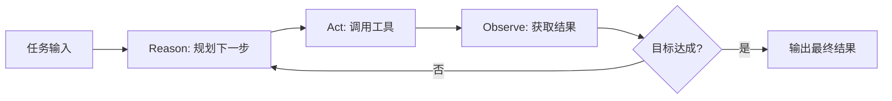

### Tool Calling Mechanism

Agent 的核心差异在于“会调用工具”，而不仅是“生成文本”。

典型链路：

1. LLM 先判断是否需要外部能力（数据库、搜索、业务 API、代码执行）。
2. 按约定 schema 生成工具调用参数。
3. 执行工具并返回结构化结果。
4. LLM 基于工具结果继续推理或生成最终答案。

关键设计点：

- 工具接口要强约束（参数类型、必填项、枚举范围）。
- 工具结果尽量结构化（JSON），降低二次解析歧义。
- 工具调用要可审计（谁在何时调用了什么、输入输出是什么）。

### ReAct Pattern

ReAct（Reason + Act）模式把“思考”和“行动”交替执行，适合多步任务。

基本循环：

- Reason：分析当前信息缺口，制定下一步计划。
- Act：调用工具或执行动作获取新证据。
- Observe：读取工具结果，更新判断。
- Repeat：直到满足终止条件。

ReAct 的价值在于把“未知问题”拆成可执行的小步，但也会引入循环风险与成本上升。

### State Management

State Management（状态管理）决定 Agent 能否稳定完成多步流程。

建议把状态分层：

- 会话状态：当前任务目标、用户约束、阶段进度。
- 工具状态：最近调用结果、失败重试次数、超时信息。
- 工作记忆：中间推理结论、待验证假设、下一步计划。

工程要求：

1. 状态应可序列化，支持中断恢复。
2. 状态更新应幂等，避免重复执行导致结果污染。
3. 关键状态要可观测，便于故障排查与回放。

没有显式状态管理的 Agent，通常在长链路任务中表现为“前后矛盾、重复调用、突然跑偏”。

### Loop Risk & Guardrails

Agent 最常见风险是陷入循环：反复调用工具但不收敛。

高频触发原因：

- 终止条件不明确（不知道何时算完成）。
- 工具返回质量差，模型不断尝试“补救调用”。
- 计划能力不足，无法从失败中调整策略。

必备 Guardrails：

1. 步数上限（max_steps）。
2. 时间上限（wall-clock timeout）。
3. 相似调用熔断（同参数重复调用阈值）。
4. 失败降级路径（改用简化流程或转人工）。
5. 高风险操作确认（写操作、外部系统变更需审批）。

Guardrails 的目标不是“限制能力”，而是“保证系统在可控边界内运行”。

### Memory Design (Short-term vs Long-term)

Agent 的记忆应区分短期与长期，避免把所有历史都塞进上下文。

短期记忆（Short-term）：

- 面向当前任务的临时状态（本轮计划、工具结果、关键中间结论）。
- 生命周期短，任务结束即可清理。
- 通常存放在会话缓存或状态存储中。

长期记忆（Long-term）：

- 面向跨会话复用的信息（用户偏好、常用配置、历史决策）。
- 需要权限控制、过期策略、可删除与可审计。
- 常结合数据库或向量检索实现“按需召回”。

设计原则：

- 短期记忆强调实时性与一致性。
- 长期记忆强调治理性（隐私、合规、可追踪）。
- 不把长期记忆直接常驻 Prompt，而是在需要时检索注入。
