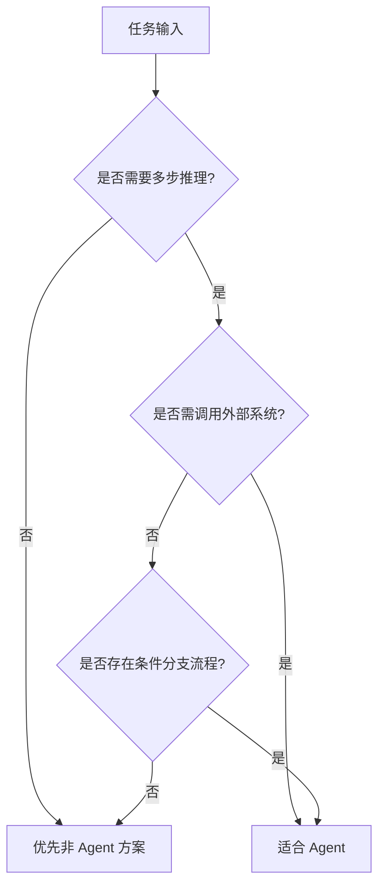

### Multi-step reasoning

当任务无法通过单次提示完成，而需要“分解 -> 求证 -> 汇总”时，适合使用 Agent。

典型场景：

- 需要多轮推理才能得到结论（如复杂根因分析、方案比选）。
- 问题依赖多条证据链，且存在先后关系。
- 中间步骤可能失败，需要动态调整下一步策略。

判断标准：

- 任务是否天然可拆分为多个可执行子步骤。
- 每一步结果是否会影响后续路径选择。
- 是否需要在中间环节做校验而非一次性输出。

如果答案必须“过程可追踪、证据可回放”，Agent 通常优于一次性生成。

### External system integration

当任务必须访问外部系统才能完成闭环时，Agent 价值最明显。

典型外部系统：

- 数据库与数据仓库（查询业务数据）。
- 企业 API（工单、CRM、ERP、审批流）。
- 搜索与知识库（实时文档与政策变更）。
- 执行系统（代码运行、任务调度、消息推送）。

Agent 适用前提：

1. 工具接口稳定且有清晰 schema。
2. 调用链路具备权限控制、审计日志与超时重试。
3. 关键写操作有确认机制与回滚策略。

没有可靠工具治理的情况下，引入 Agent 会放大系统风险而非提升效率。

### Conditional workflow

当流程不是固定线性，而是“根据条件选择分支”时，应优先考虑 Agent。

典型特征：

- 同一入口问题会走不同处理路径（如按用户等级、风险级别、数据完整度分流）。
- 流程中包含 if/else、重试、人工兜底等分支逻辑。
- 终态不唯一，需要根据执行结果动态收敛。

落地建议：

- 把业务规则显式化（规则引擎或策略表），不要完全依赖隐式提示。
- 为每个分支定义进入条件、退出条件、失败处理策略。
- 记录分支命中率与成功率，持续优化流程设计。

一句话原则：当任务同时具备“多步性 + 外部交互 + 条件分支”中的至少两项时，Agent 通常是更合适的架构选择。
