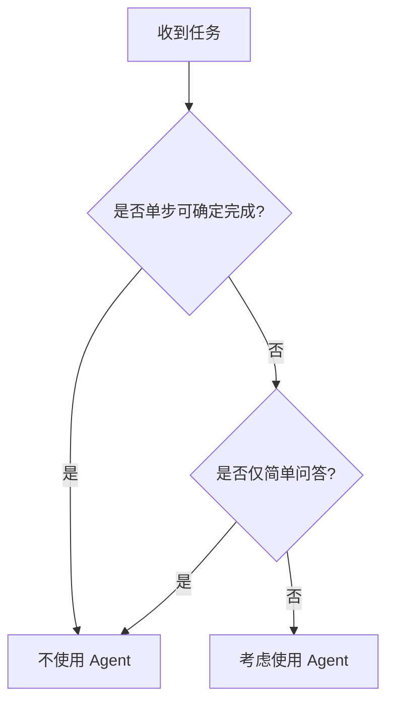

### Single-step deterministic generation

当任务本质是“单步、确定性、可模板化输出”时，不应优先使用 Agent。

典型特征：

- 输入到输出映射稳定，几乎不需要中间推理分解。
- 不依赖外部工具调用，也不存在动态分支。
- 对一致性要求高于灵活性（如标准通知、固定格式摘要、结构化抽取）。

为什么不建议用 Agent：

- 引入额外编排层，增加延迟与成本。
- 工具决策与循环控制带来不必要的不确定性。
- 调试面扩大，问题定位复杂度上升。

更合适方案：

1. 固定 Prompt 模板 + 低温参数。
2. 明确输出 schema（JSON/表格）并做解析校验。
3. 必要时使用规则引擎后处理，确保确定性结果。

一句话：能“一次调用稳定完成”的任务，不要为了“看起来高级”而强行 Agent 化。

### Simple Q&A

对于简单问答（尤其是事实直接可得、上下文短、回答路径单一），Agent 通常是过度设计。

典型场景：

- FAQ、术语解释、基础概念问答。
- 单文档内定位式问答（命中即答，无需多步推理）。
- 用户期望低延迟即时响应的交互式场景。

为什么不建议用 Agent：

- 多一步规划和工具选择，响应时间更长。
- 引入额外失败点（工具超时、分支误判、循环风险）。
- 成本上升但质量提升有限。

更合适方案：

- 直接 LLM 问答（低温、短上下文）。
- 简化版 RAG（小 `TopK` + 无重排或轻重排）。
- 预计算 FAQ 缓存与命中回退策略。

实践原则：默认先用“最小可行架构”，只有当任务明确需要多步决策与工具编排时，再升级为 Agent。
