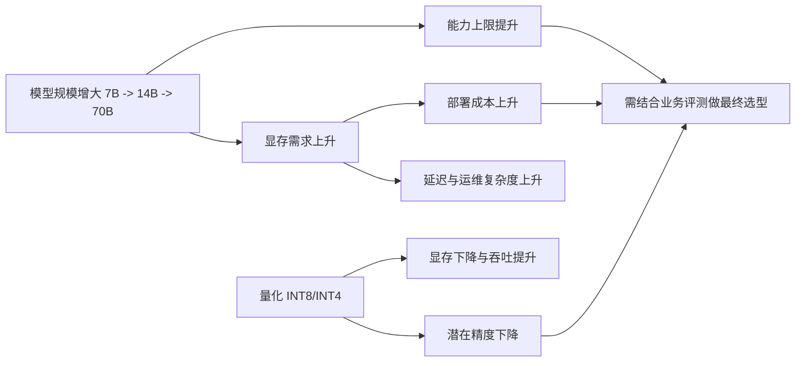

### 7B / 14B / 70B parameter implications

模型参数规模直接影响能力上限、推理成本与部署复杂度，但不是“越大越好”。

可用一个简化认知：

- 7B：成本低、速度快，适合简单任务与高并发场景。
- 14B：在质量与成本之间更均衡，适合通用企业助手。
- 70B：复杂推理与长链路表现更强，但延迟和成本显著上升。

典型取舍维度：

| 维度 | 7B | 14B | 70B |
|---|---|---|---|
| 推理质量 | 基础可用 | 中高 | 高 |
| 延迟 | 低 | 中 | 高 |
| 单次成本 | 低 | 中 | 高 |
| 部署门槛 | 低 | 中 | 高 |
| 适用任务 | FAQ/分类/抽取 | 通用问答/流程助手 | 复杂推理/高价值决策支持 |

实践建议：先用“小模型可达标”作为默认假设，再通过评测证明是否需要升级到更大模型。

### API Model vs Self-hosted Model

企业常见两条路线：调用 API 模型，或自托管模型（Self-hosted）。

API Model 优势：

- 上线快，免去模型运维与底层基础设施管理。
- 能快速使用最新模型能力。
- 弹性扩缩容由供应商承担。

API Model 挑战：

- 成本受调用量和 token 波动影响大。
- 数据出域与合规要求需要严格评估。
- 对供应商 SLA、配额和产品变更存在依赖。

Self-hosted 优势：

- 数据与系统控制权更高，便于满足强合规场景。
- 大规模稳定流量下可能更具成本可预测性。
- 可深度定制推理栈（量化、路由、缓存、批处理）。

Self-hosted 挑战：

- 需要 GPU、推理框架、监控、弹性调度等完整工程体系。
- 初期建设与持续运维成本高。
- 模型升级、兼容性和性能调优需要专业团队。

选型原则：

1. 业务早期优先 API 验证价值与需求规模。
2. 当流量稳定且合规/成本压力明确时，再评估自托管迁移。
3. 可采用混合架构：常规流量自托管，峰值或高阶能力走 API。

### Quantization (INT8 / INT4)

量化（Quantization）通过降低权重与激活精度，换取更低显存占用和更高吞吐。

常见精度：

- INT8：精度损失通常较小，收益与稳定性平衡较好。
- INT4：压缩更激进，显存和吞吐收益更高，但精度回退风险更大。

工程收益：

- 降低 GPU 显存需求，支持更大模型或更高并发。
- 提升单位硬件吞吐，降低单请求成本。
- 缩短冷启动与加载时间（视框架和权重格式而定）。

主要风险：

- 复杂推理、代码生成、长文本一致性可能退化。
- 不同模型与框架对量化敏感度差异大。
- 缺少场景评测时，容易出现“省了成本，丢了质量”。

落地建议：

1. 先做任务级离线评测（准确率、拒答率、幻觉率）。
2. 逐级试验：FP16 -> INT8 -> INT4，而非一步到位。
3. 对高风险业务保留高精度回退通道。

结论不是“选最大模型”，而是“在目标质量达标前提下，选择总拥有成本最低的组合”。
