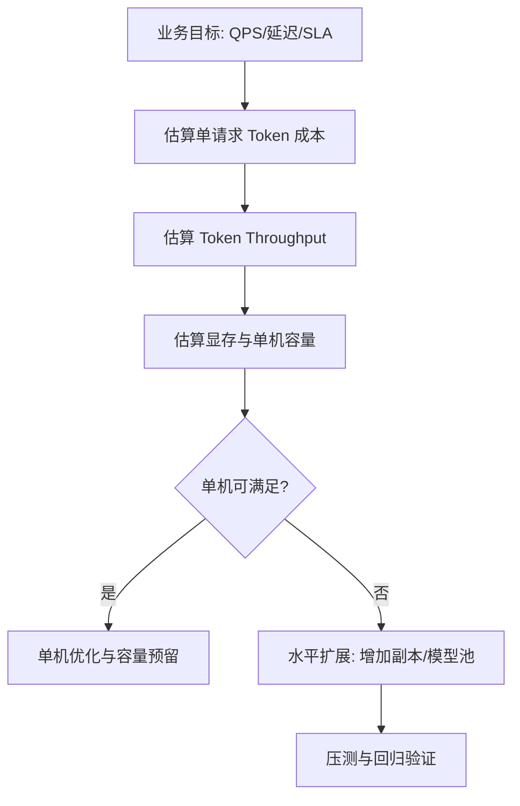

### Token pricing calculation

API 模型成本通常先从 token 计费开始估算。

基础公式：

```text
单请求成本 = (input_tokens / 1,000,000) * 输入单价
          + (output_tokens / 1,000,000) * 输出单价
```

月度估算：

```text
月成本 = 单请求成本 * 月请求量
```

估算建议：

1. 分场景统计 token（FAQ、分析、报告生成）而不是只算全局平均。
2. 使用 P50/P95 双口径，避免低估长尾请求。
3. 把系统提示、检索上下文、历史对话都计入 input_tokens。

### GPU memory requirement estimation

自托管场景下，显存是容量规划第一约束。

简化估算思路：

```text
显存需求 ≈ 模型权重 + KV Cache + 运行时开销
```

关键影响因子：

- 模型规模（参数量越大，权重占用越高）。
- 权重精度（FP16 / INT8 / INT4）。
- 并发请求数与上下文长度（直接影响 KV Cache）。
- 推理框架与批处理策略（额外 runtime buffer）。

工程实践：

1. 不只看“能加载模型”，要看目标并发下是否稳定。
2. 预留 15%~30% 显存余量，避免峰值 OOM。
3. 先做小流量压测，再按真实分布放大。

### QPS × Context Length × Output Length

吞吐与成本可通过一个简化乘积模型快速判断压力等级。

```text
Token Throughput（tokens/s）≈ QPS * (平均输入长度 + 平均输出长度)
```

进一步可得到资源与成本趋势：

- QPS 上升：需要更多并行算力或更强批处理能力。
- Context Length 上升：单请求推理时延增加，KV Cache 压力上升。
- Output Length 上升：生成阶段耗时与成本线性增长。

落地建议：

1. 为不同业务设置 token 预算上限（输入与输出分开）。
2. 建立“超长请求降级策略”（裁剪上下文、切换小模型、异步返回）。
3. 用压测数据拟合 QPS-延迟曲线，避免仅靠理论估算。

### Horizontal scaling considerations

当单机无法满足目标 QPS 或可用性要求时，需要水平扩展。

核心关注点：

- 无状态服务化：推理节点尽量无状态，便于弹性扩缩容。
- 负载均衡策略：按模型池、租户、优先级进行流量分发。
- 队列与背压：峰值流量通过队列削峰，防止系统雪崩。
- 多副本一致性：模型版本、量化版本、Prompt 版本要严格对齐。

常见扩展策略：

1. 模型池分层：小模型池承接大部分流量，大模型池处理复杂请求。
2. 读写分离：在线推理与离线索引/批处理任务隔离资源。
3. 多可用区部署：提升容灾能力，降低单点故障风险。



成本估算的目标不是得到“绝对精确值”，而是建立可持续迭代的预算模型：可预测、可监控、可纠偏。
