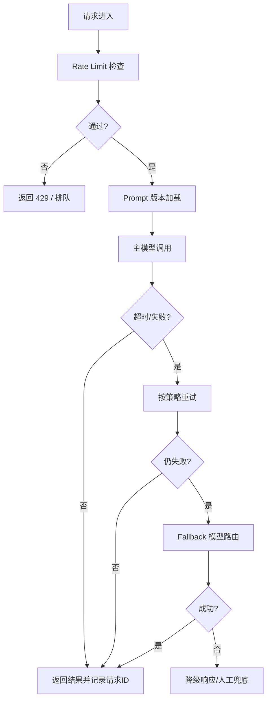

### Timeout Control

AI 系统的超时控制不是“单一超时”，而是端到端分层超时。

建议拆分：

- 客户端超时：控制用户等待体验上限。
- 网关超时：防止请求长期占用连接。
- 工具调用超时：约束外部依赖（DB/API/搜索）故障扩散。
- 模型推理超时：限制长尾请求拖垮吞吐。

设计原则：

1. 下游超时必须小于上游超时，避免级联阻塞。
2. 明确“超时后的行为”（返回降级结果、重试、转异步）。
3. 重点监控 P95/P99 超时率，而非仅平均响应时间。

### Retry Strategy

重试策略用于处理瞬时失败，但不合理的重试会放大故障。

适合重试的场景：

- 网络抖动、临时 5xx、短时限流。

不适合盲重试的场景：

- 参数错误、权限错误、确定性业务失败。

推荐策略：

1. 指数退避（Exponential Backoff）+ 随机抖动（Jitter）。
2. 设置最大重试次数与总重试时间预算。
3. 区分错误类型：仅对可恢复错误重试。
4. 重试链路必须携带请求 ID，便于追踪与去重。

### Fallback Model Routing

当主模型不可用、超时或成本超预算时，需要自动路由到备选模型。

常见触发条件：

- 主模型响应超时或错误率超阈值。
- 峰值流量导致容量不足。
- 请求复杂度较低，可降级到小模型。

路由层设计建议：

- 主备模型能力画像（质量、延迟、成本）要可配置。
- 降级策略要按任务类型定义，不做“一刀切”。
- 对高风险请求可采用“主模型失败 -> 保守模板答复/人工兜底”。

目标是“服务连续性优先”，同时把质量退化控制在可接受范围。

### Prompt Versioning

Prompt 在生产中应像代码一样版本化管理。

最小治理单元：

- Prompt 内容版本号（如 `prompt_v12`）
- 适用模型版本
- 参数组合（temperature/top_p/max_tokens）
- 生效时间与变更说明

实践要求：

1. 禁止直接在线手改 Prompt。
2. 每次变更必须配套回归评测结果。
3. 支持灰度发布与快速回滚。

Prompt 版本不可追踪，会直接导致“线上效果变差但无法定位原因”。

### Rate Limiting

限流用于保护系统稳定性与公平性，避免单租户或突发流量压垮推理服务。

常见限流维度：

- 用户级/租户级 QPS
- 并发请求数
- token 吞吐上限（tokens per minute）

策略建议：

1. 分层限流：网关层粗限流 + 业务层细粒度限流。
2. 配额分级：VIP 与普通租户采用不同限额与优先级。
3. 超限响应明确（429 + 重试建议 + 退避时间）。
4. 峰值时配合排队与背压，不要直接雪崩失败。

### Idempotency Handling

AI 工作流经常涉及重试与异步回调，幂等性是避免重复执行的关键。

高风险重复场景：

- 同一请求重复扣费或重复写入外部系统。
- 重试导致重复发送通知/工单。
- 异步回调乱序导致状态回退。

实现要点：

1. 为每个业务请求生成 `idempotency_key`。
2. 对写操作结果做“去重存储 + 状态机校验”。
3. 幂等窗口内重复请求直接返回首次结果。
4. 对外部副作用操作记录操作日志与回放标记。

可靠性设计的核心是把“不确定性”变成“可控制、可观测、可回滚”的工程机制。
