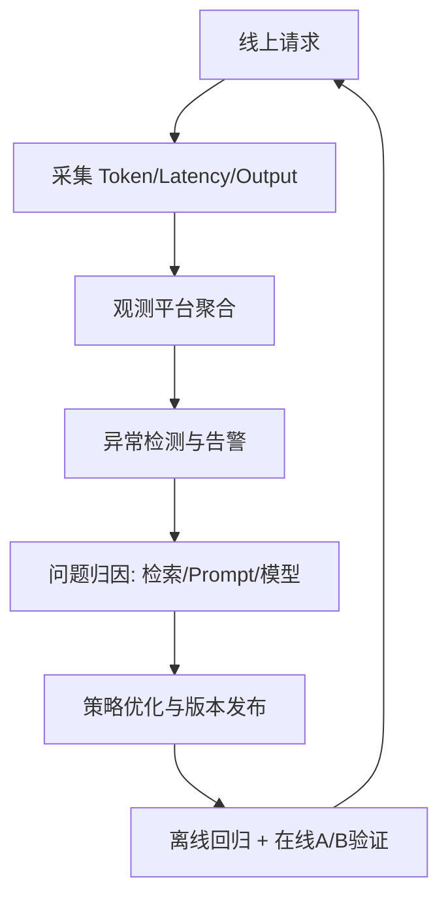

### Token usage monitoring

Token 观测是 AI 系统成本治理与性能优化的基础。

建议最小监控维度：

- `input_tokens`：系统提示、用户输入、检索上下文、历史对话总和。
- `output_tokens`：模型生成长度。
- `total_tokens`：单请求总 token。
- `tokens_per_success`：每次成功请求的平均 token 消耗。

分层分析建议：

1. 按业务场景拆分（FAQ、分析、写作、Agent 工具链）。
2. 按租户/用户拆分（识别异常流量与成本热点）。
3. 按模型版本与 Prompt 版本拆分（定位回归）。

如果只看月账单，不看 token 结构，几乎无法精准优化成本。

### Latency distribution

平均延迟不能反映真实用户体验，必须关注分位数分布。

核心指标：

- `p50`：常态体验。
- `p95`：大多数用户在高峰时段的真实感受。
- `p99`：长尾风险与稳定性边界。

建议做分阶段延迟观测：

- 检索延迟（retrieval）
- 重排延迟（rerank）
- 模型首 token 延迟（TTFT）
- 生成完成延迟（end-to-end）

治理原则：

1. 先定位长尾在哪一段，再定向优化。
2. 设定 SLO（如 P95 < 3s）并持续告警。
3. 对超时请求保留完整链路日志，支持快速复盘。

### Hallucination feedback loop

幻觉治理不能依赖一次性规则，必须形成持续反馈闭环。

闭环流程：

1. 采集：收集用户纠错、人工审核、不一致检测结果。
2. 标注：区分“无依据生成”“依据错误”“引用不一致”等类型。
3. 评测：在固定评测集上跟踪幻觉率变化。
4. 优化：调整检索、Prompt、模型路由与拒答策略。
5. 回归：上线前后做对比验证，防止副作用。

建议指标：

- `hallucination_rate`
- `citation_mismatch_rate`
- `no_evidence_answer_rate`
- `human_override_rate`

目标不是“零幻觉”，而是“可监控、可解释、可持续下降”。

### Prompt performance tracking

Prompt 是线上策略的一部分，必须纳入版本化性能追踪。

每个 Prompt 版本建议记录：

- 版本号与生效时间
- 关联模型与参数
- 主要目标指标（正确率、完成率、拒答率、token 成本、延迟）
- 变更说明与回滚条件

追踪方法：

1. 建立 Prompt 级仪表盘（按版本对比）。
2. 对关键场景做固定回放集回归测试。
3. 结合线上 A/B 数据判断是否全面发布。

可观测性的价值不在“看到了数据”，而在“能用数据驱动迭代决策并持续提升质量”。
