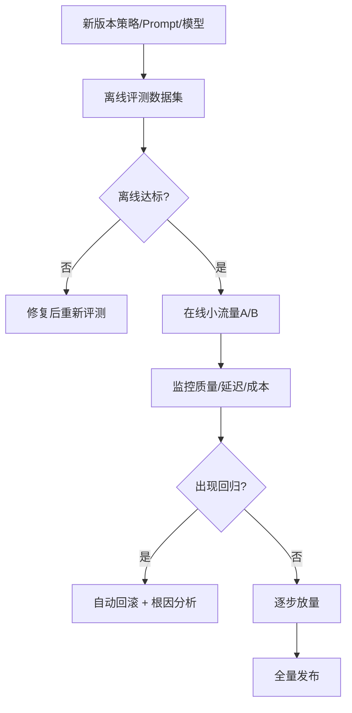

### Offline evaluation dataset

离线评测数据集是上线前质量门禁的基础，没有稳定数据集就无法比较版本优劣。

数据集设计原则：

- 覆盖真实场景分布：高频问题、长尾问题、异常输入都要包含。
- 包含难例与边界例：冲突信息、缺失信息、歧义问题。
- 标注可复现：统一标注规范与评分标准。

建议数据分层：

1. 基础集：验证常规准确率与格式正确性。
2. 风险集：验证安全、合规、幻觉与拒答策略。
3. 回归集：沉淀历史故障案例，防止重复踩坑。

常见评测指标：

- 正确率/完成率
- 引用覆盖率与引用一致性
- 幻觉率与拒答率
- token 成本与响应时延（离线近似）

### Online traffic split

离线通过后，必须通过在线流量分流验证真实用户效果。

常见分流方式：

- 百分比分流：如 `90%` 控制组 / `10%` 实验组。
- 按租户或用户组分流：降低跨组干扰。
- 分阶段放量：`1% -> 5% -> 20% -> 50% -> 100%`。

上线原则：

1. 先小流量验证稳定性，再逐步放量。
2. 控制组与实验组保持除“实验变量”外一致。
3. 设置自动熔断阈值（错误率、延迟、成本超标立即回切）。

关键观测维度：

- 质量：正确率、用户满意度、人工接管率。
- 体验：P95 延迟、失败率、超时率。
- 成本：单请求 token、总成本、单位成功成本。

### Regression detection

回归检测用于识别“新版本比旧版本退化”的问题，尤其是隐性质量下降。

回归类型：

- 功能回归：以前能答对的问题现在答错。
- 性能回归：延迟、超时、资源占用恶化。
- 成本回归：token 或调用成本异常上升。
- 安全回归：越权、泄露、违规输出增加。

检测机制建议：

1. 设定硬阈值（如准确率下降 > 2% 触发告警）。
2. 使用统计检验判断差异显著性，避免噪声误判。
3. 对关键指标做逐日趋势监控，识别慢性退化。
4. 建立“一键回滚”能力，缩短故障恢复时间。

A/B 测试的目标不是“证明新方案更好看”，而是用可量化证据证明“新方案在质量、稳定性和成本上整体更优”。
