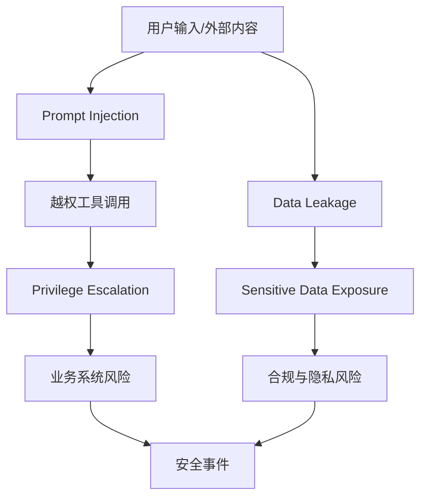

### Prompt Injection

Prompt Injection 是指攻击者通过输入内容操控模型行为，绕过原有系统指令与安全约束。

常见方式：

- 直接注入：在用户输入中加入“忽略之前所有指令”等恶意命令。
- 间接注入：把恶意指令埋在网页、文档、邮件等外部数据中，诱导 Agent 执行。
- 工具链注入：通过工具返回结果夹带指令，影响后续决策。

潜在影响：

- 模型泄露系统提示词或内部策略。
- 执行未授权操作（调用高风险工具、访问受限数据）。
- 输出不可信结果并误导业务决策。

防护重点：

1. 明确指令优先级边界（system > developer > user > external content）。
2. 外部内容默认不可信，进入模型前做清洗与标记。
3. 对工具调用增加策略校验，不允许“文本直接驱动高危动作”。

### Data Leakage

Data Leakage 指敏感数据在模型交互、日志、存储或下游输出中被非预期暴露。

高风险环节：

- Prompt 组装阶段拼入了不应共享的内部数据。
- 调试日志记录完整输入输出，包含用户隐私或密钥。
- 多租户检索隔离不严，跨租户内容被错误召回。

常见后果：

- 合规违规（隐私法、行业监管要求）。
- 商业机密与客户数据泄露。
- 安全事件追责与品牌信任损失。

防护重点：

1. 数据最小化原则：只注入完成任务所需最少信息。
2. 日志脱敏与分级存储（默认不落敏感明文）。
3. 全链路权限与租户隔离校验（检索前后双重校验）。

### Privilege Escalation

Privilege Escalation 指模型或 Agent 在工具调用过程中越过原始权限边界，执行高权限操作。

典型触发场景：

- 共享服务账号权限过大，所有请求都可访问高风险系统。
- 工具接口未校验调用者身份，仅凭模型文本决策执行。
- 缺少操作审批，写操作可被自动链路直接触发。

主要风险：

- 未授权数据读取/写入。
- 非法变更业务系统状态（工单、订单、权限配置）。
- 安全边界被绕过后形成横向攻击路径。

防护重点：

1. 工具调用必须基于用户上下文做鉴权，不信任模型“自述权限”。
2. 高危动作引入二次确认与审批机制（human-in-the-loop）。
3. 采用最小权限 Token 与短期凭证，降低滥用窗口。

### Sensitive Data Exposure

Sensitive Data Exposure 指模型输出了不应展示的敏感信息，即使系统本意并非泄露。

常见敏感类型：

- 个人隐私（身份证号、手机号、住址、健康信息）
- 凭证信息（API Key、访问令牌、数据库连接串）
- 商业机密（财务数据、合同条款、内部策略）

暴露路径：

- 训练或检索语料中存在敏感字段且未做脱敏。
- 输出过滤缺失，模型“照抄”上下文内容。
- 引用机制不受控，把内部原文直接回传给低权限用户。

防护重点：

1. 输入与知识库双侧脱敏（采集前、入库前、检索前）。
2. 输出审核层（规则 + 模型双重审查）拦截敏感字段。
3. 对外返回采用“必要摘要”而非原文直出。

企业 AI 安全的核心不是“完全阻断风险”，而是通过分层防护与可审计机制，把风险控制在可接受范围内。
