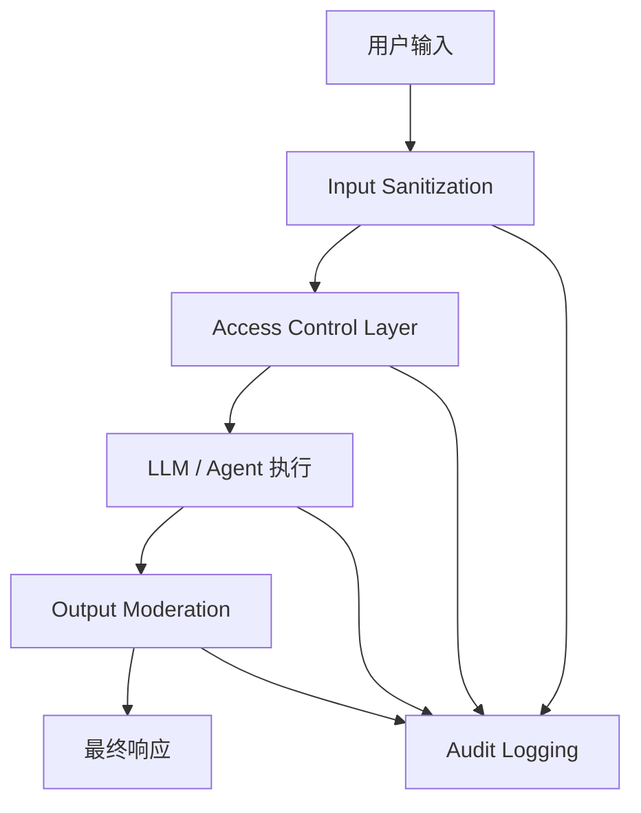

### Audit Logging

审计日志是 AI 治理的底座，目标是“可追踪、可复盘、可问责”。

最小日志字段建议：

- 请求标识：`request_id`、`session_id`、时间戳
- 主体信息：用户/租户/角色
- 关键输入：Prompt 版本、模型版本、工具调用参数摘要
- 关键输出：响应摘要、风险标签、是否触发拦截
- 执行轨迹：工具调用链、重试、降级、回滚动作

实施要点：

1. 日志分级与脱敏，避免审计系统本身泄露数据。
2. 关键事件不可篡改存储（WORM/签名校验）。
3. 支持按请求 ID 全链路追踪，缩短故障定位时间。

### Access Control Layer

访问控制层负责把“谁可以做什么”落到每一次请求与每一次工具调用上。

建议采用双层控制：

- 身份与角色控制（RBAC）：按用户、岗位、租户限制权限范围。
- 属性策略控制（ABAC）：结合数据分级、环境、时间、设备等动态条件。

治理要点：

1. 统一鉴权入口，避免各子系统自行实现导致规则漂移。
2. 检索前后双重权限校验（pre-filter + post-check）。
3. 对高危操作启用强校验（审批、二次确认、短期凭证）。

目标是把“模型会做什么”约束在“用户被允许做什么”之内。

### Output Moderation

输出审核用于拦截不安全、不合规、越权或敏感内容，防止模型结果直接造成风险。

常见审核维度：

- 合规风险：隐私泄露、违规建议、行业监管禁区
- 安全风险：攻击性内容、恶意指令、越权信息
- 业务风险：虚假承诺、错误引用、不可执行建议

落地方式：

1. 规则引擎：关键词、正则、敏感字段检测（高确定性）。
2. 模型审核：语义级风险识别（覆盖隐式风险）。
3. 分级处置：通过、打码、重写、拦截、转人工审核。

输出审核不是“只拦截”，还应支持可解释反馈（告诉用户为何被拒绝或降级）。

### Input Sanitization

输入净化用于降低 Prompt Injection、越权指令、脏数据和格式攻击带来的风险。

关键措施：

- 结构化解析：把自由文本映射为受控字段，减少指令歧义。
- 恶意模式过滤：识别“忽略规则”“执行系统命令”等高风险片段。
- 内容标准化：统一编码、去除控制字符、限制超长输入。
- 外部数据标注：明确“引用内容不等于系统指令”。

实施建议：

1. 在网关层做第一道净化，在业务层做场景化二次净化。
2. 对被净化内容保留审计记录，便于后续规则迭代。
3. 对高风险输入执行“降权处理”（限制工具调用、仅只读回答）。

治理机制的价值在于把安全与合规从“人工兜底”升级为“系统内建能力”，并且可持续演进。
